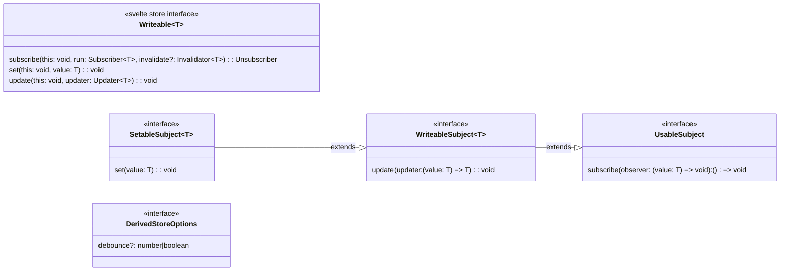
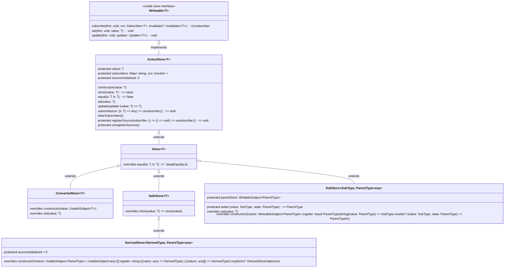

# svelte-store
Support library offering new types of store that compliment the basic svelte readable/writable stores.
<br />

## General Interfaces
Starting with the Svelte `Writeable` interface to ensure interoperability this library defines some of its own classifications of stores that fit the extention needs of this library as well as some types for specifying options to different store constructors and behavior modifiers.

<br />

## New Store Classes
Due to the sub-property mutability limitations of the native Svelte Stores a solution was desired that would allow flexibility for more granularly nested value states. In addition there are situations where callbacks are desired on value updates regardless of the value actually changing so to support this - and deeper granularity/nesting in the stores state - this library adds an `equal` function to stores to allow for control over how value callbacks are triggered on `set` and `update`. Also, with the addition of more deeply nested states, the store functionality needs to include a `clone` operation that allows for control of the mutatbility of the value state returned as well as the granularity of what is returned from the store. In addition to those extentions there may be cases where the external sources of a store need to be changed out so `unregisterSources` is added to provide a means to run all cleanup functions needed and reset the store to make it ready for a new source provided to it by the additionally added [`registerSource`](https://github.com/txstate-etc/svelte-store/blob/main/src/activestore.ts#:~:text=protected%20registerSource) function.

- [`ActiveStore`](#activestore) - actively calls subscribers back regardless of whether the update to value was a change or not.
- [`Store`](#store) - extends `ActiveStore` overriding its `equal` to do a `deepEqual`. Note that this not only returns back to the traditional callback handling on equality but also adds a deeper checking for equality so that any potential sub-states, or object properties, will trigger callbacks instead of just the parent state being evaluated.
- [`ConvertedStore`](#convertstore) - allows a traditional Svelte Store to be passed in its constructor to return a reference to a new `Store` object with its `set` overrided to handle the differences between this Store framework and the traditional Svelte Store framework. A [`convertStore`](https://github.com/txstate-etc/svelte-store/blob/main/src/convertedstore.ts#:~:text=export%20function%20convertStore) factory function is also exported.
- [`SubStore`](#substore) - Creates a store that will represent a part of a larger store. Updates to the parent store will propagate to SubStores as appropriate and updates to SubStores will propagate back up to parent stores. This is handled by default through the use of dot-prop strings (Example: `{ deep: { value: 'here' }, hello: 'World'}` could refer to that `value` prop as 'deep.value'), OR custom `getter` and `setter` functions could be provided to the [`subStore`](https://github.com/txstate-etc/svelte-store/blob/main/src/substore.ts#:~:text=export%20function%20subStore) factory functions that can provide custom handling of the getting and setting propagation. Note that cloning of `SubStore`s will protect from mutability unless the parent store is an instance of a `SafeStore` with `clone` overridden for its own purposes that do not protect from mutability.
- [`SafeStore`](#safestore) - as an extention of `Store`, and unlike `ActiveStore`, this does deep equality checks before notifying subscribers. It additionally actually clones data on its `clone` operation so that it's safe against subscriber mutations. Costs more CPU cycles but also results in fewer notifications to subscribers.
- [`DerivedStore`](#derivedstore) - watches one or more parent stores for changes. For each change it runs a function to derive a new state from the parent state(s). Subscribers will only be notified if the derived state has changed (checks deep equality). Note that cloning of `DerivedStore`s will try to revert to `SafeStore`'s handling of the `clone` except for when the parent store is an extention of `SafeStore` to possibly override `SafeStore`'s clone for its own purposes. On construction an optional `debounce` timer can be applied to the `DerivedStore` `set` operations with a numerical number of milliseconds or a boolean true evaluating to the next timeout cycle. A set of [`derivedStore`](https://github.com/txstate-etc/svelte-store/blob/main/src/derivedstore.ts#:~:text=%7D-,export%20function%20derivedStore,-%3CParentType%2C) factory functions are also exported.



## Subclassing
The most effective way to use a store is to create a Store subclass with mutation
methods. If you're familiar with redux, these methods would be similar to actions on
reducers.
```typescript
interface MyState {
  foo: string
  more: string
}
class MyStore extends Store<MyState> {
  updateFoo (newfoo: string) {
    // do some business logic here
    newfoo = newfoo.trim().toLocaleLowerCase()
    this.set({ ...this.value, foo: newfoo })
  }
}
const store = new MyStore({ foo: 'bar', more: 'state' })
store.updateFoo('baz')
```
This way your store controls all the business logic and your components can be truly
reactive.

Note that `this.value` contains the current version of the store. You can also use the
`store.update` method to have the current value passed to you.

### Asynchronous mutations
Mutation methods become even more powerful when you do asynchronous updates. All of
your asynchronous code can be encapsulated in a single method, making it much easier
to think about how you want to handle race conditions and errors. Redux toolkit would
call these `thunk` functions, but here they are just another method.
```typescript
interface BookState {
  loading?: boolean
  book?: Book
  error?: string
}
class BookStore extends Store<BookState> {
  async getBook (id: number) {
    if (this.value.loading) return // one book at a time!
    this.set({ loading: true, book: undefined, error: undefined })
    try {
      const book = await api.getBook(id)
      this.set({ loading: false, book, error: undefined })
    } catch (e) {
      this.set({ loading: false, book: undefined, error: e.message })
    }
  }
}
```

### Creating and sharing store instances
It's up to you to determine how you'd like to create and share stores. The singleton
pattern works great for end user applications. For instance, a global error store can
help individual components communicate with the layout component when they experience
a problem that's fatal for the page. Creating a singleton store for each screen in your
application is another powerful pattern and helps all your components share the screen
state.

Context can be very convenient as well. The main benefit of putting a store in Context
is it can be garbage collected when the context owner is unmounted. In SSR scenarios,
global stores can leak between clients unless you're careful to reset them on each request,
so storing in Context can be safer.

Similarly, a store can be created in a component and passed down as a prop, enabling
efficient two-way communication with its children. The main advantage over binding a
property is that the components can share the mutation methods.

## Uses for Store Types

### `ActiveStore`
This is a store that does no equality checks before notifying subscribers. It can save a couple
CPU cycles by skipping the deep equality check, but may be an overall performance degradation
if subscribers are doing significant work and there are many updates that do not change the state.
It is also vulnerable to unexpected infinite loops if subscribers end up triggering a redundant
`set` command. This store is safe to use with mutated objects and is the only one that can
handle non-JSON objects in the state.

### `Store`
This is the basic store type and performs deep equality checks before notifying subscribers.
It is intended to contain simple JSON state that is easy to programmatically explore. By
default, you are expected to update the store with fresh or cloned objects:
```typescript
const initialState = { foo: 'bar', more: 'state' }
const store = new Store(initialState)
store.update(state => ({ ...state, foo: 'baz' }))
```
### `SafeStore`
If it's not convenient to clone your objects, you can use a `SafeStore` instead,
which will allow you to mutate your state and then call `set` on it:
```typescript
const initialState = { foo: 'bar', more: 'state' }
const store = new SafeStore(initialState)
initialState.foo = 'baz'
store.set(initialState) // with a regular Store, this would not notify subscribers
```
This is only designed to work on pure JSON (objects and arrays, not Maps, Sets, or
any other data types). There is a slight performance cost due to deep cloning.
### `SubStore`
This is a store that makes it convenient to interact with a portion of a larger store. You
subscribe to a parent store in the constructor, and when you update the SubStore, your
changes will be sent to the parent store.

#### Getter / Setter version of `SubStore`
This requires both a getter and setter function to handle each direction. The setter is given
the new SubStore state and the existing parent store state and should return a new state for
the parent store.
```typescript
const parentStore = new Store({
  about: { header: 'About' },
  events: { header: 'Events' }
})
const aboutStore = new SubStore(parentStore, pState => pState.about, (newAboutState, pState) => ({ ...pState, about: newAboutState }))
aboutStore.set({ header: 'About Us' })
// aboutStore state is { header: 'About Us' }
// parentStore state is { about: { header: 'About Us' }, events: { header: 'Events' } }
```

#### Accessor string version of `SubStore`
Alternatively, a dot-prop accessor string can be provided and both the getter and setter will be
automatically generated.
```typescript
const parentStore = new Store({
  about: { header: 'About' },
  events: { header: 'Events' }
})
const aboutStore = subStore(parentStore, 'about')
aboutStore.set({ header: 'About Us' })
// aboutStore state is { header: 'About Us' }
// parentStore state is { about: { header: 'About Us' }, events: { header: 'Events' } }
```
Note the use of a `subStore` function rather than `new SubStore`. `new SubStore` will work just
fine, but since typescript (at the time of writing) does not allow method overloads on the
constructor, there was no way to automatically derive types. Make a habit of using the `subStore`
function if you use typescript.

#### Subclassing `SubStore`
If you want to create a class and mutation methods for your SubStore, you'll want to create an
interface for your parent type that requires a minimum interface of the part you deal with. Then
you create a custom constructor with your accessor or setter/getter.
```typescript
interface AboutType {
  header: string
}
interface HasAboutType {
  about: AboutType
}
class AboutStore<ParentType extends HasAboutType> extends SubStore<AboutType, ParentType> {
  constructor (parentStore: WritableSubject<ParentType>) {
    super(parentStore, 'about')
  }

  updateHeader (newHeader: string) {
    this.update(state => ({ ...state, header: newHeader }))
  }
}
const parentStore = new Store({
  about: { header: 'About' },
  events: { header: 'Events' }
})
const aboutStore = new AboutStore(parentStore)
aboutStore.updateHeader('About Us')
```
Note the use of `WritableSubject` in the constructor. This is exported from our library, and is
a generic way of accepting any kind of store - it accepts anything with a `subscribe` and `update`
method. So you can write a SubStore that accepts default svelte stores as well as one of our stores.

### `derivedStore`
`derivedStore` is designed to allow you to compile data from one or more parent stores into another
read-only store. Each time any parent store changes, we'll run a function to derive a new state from
the parent state(s). This is extremely similar to svelte's `derived` store, but subscribers will only
be notified if the derived state has changed (uses a deep-equal instead of svelte's shallow equality).
```typescript
const num1Store = new Store(5)
const num2Store = new Store(7)
const sumStore = derivedStore([num1Store, num2Store], ([num1, num2]) => num1 + num2)
// sumStore state is 12
num1Store.set(3)
// sumStore state is 10
```
If you only use one parent store, it's possible to use a dot-prop string as the getter, basically a
read-only version of SubStore.

### `convertStore`
`convertStore` is provided to add deep equality checks to a svelte store. The state is duplicated into
one of our stores, but the duplicate is kept in sync with the parent svelte store and vice-versa. You can
feel free to `set` and `update` the converted store even if some of your code still uses the parent svelte
store.
```typescript
const svelteStore = writable({ putit: 'there' })
const deepEqualStore = convertStore(svelteStore)
svelteStore.set({ putit: 'here' })
// both stores have state { putit: 'here' }
deepEqualStore.set({ putit: 'there' })
// both stores are back to { putit: 'there' }
deepEqualStore.set({ putit: 'there' })
// no subscribers are notified, because deepEqualStore caught that nothing was updated
svelteStore.set({ putit: 'there' })
// svelteStore subscribers are notified, but deepEqualStore subscribers are not
```
